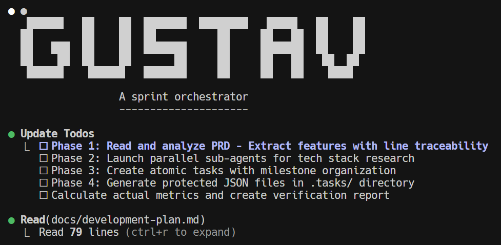
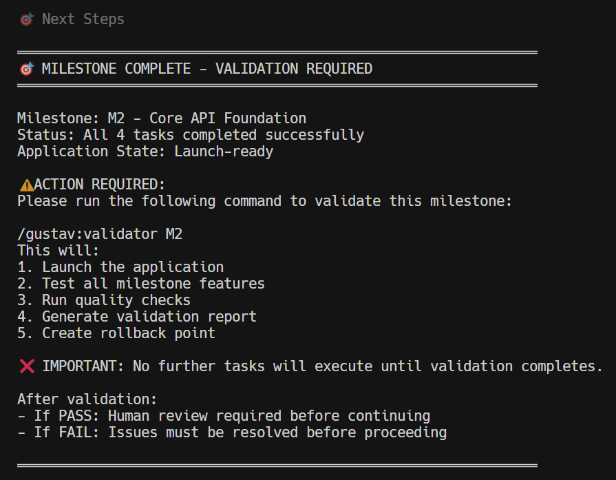
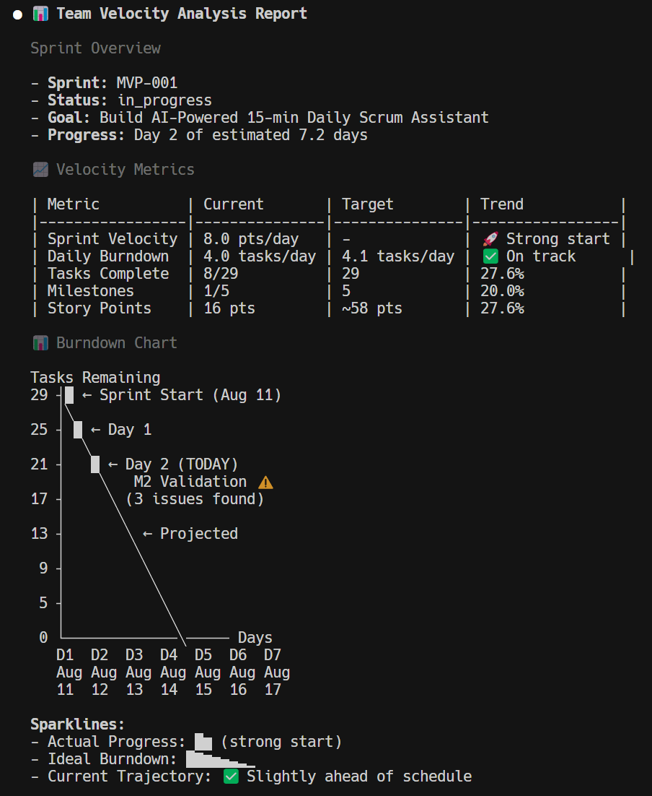

                   ██████   ██    ██  ███████  ████████   █████   ██    ██
                  ██        ██    ██  ██          ██     ██   ██  ██    ██
                  ██   ███  ██    ██  ███████     ██     ███████  ██    ██
                  ██    ██  ██    ██       ██     ██     ██   ██   ██  ██ 
                   ██████    ██████   ███████     ██     ██   ██    ████

                          A sprint orchestrator for Claude Code
                                  ---------------------

Welcome to Gustav, named after the legendary Orchestrator Gustav Mahler. This prompt framework is designed to turn your idea into an enterprise-grade application with lots of protection against over-engineering, feature creep, hallucinations and buggy code.

Gustav will pro-actively monitor progress and code quality, so you can focus on the features.

**Disclaimer:** This project is in beta. If you encounter any issues, please let me know!

## The Sprint Planner

To start out you need a Product Requirements Document (PRD) detailing your application idea. You can place the document anywhere you like, as long as it is in the same project folder or one of its sub-folders.

Just run: 

```
/gustav:planner <PRD PATH>
```

Gustav will not do a lot of research so your application will be developed using the latest technologies in the best framework(s) for your particular goal. It will also decide which 7 features are going to be in the MVP version. Don't worry, Gustav will not remove any features. Any feature that doesn't make the cut for the MVP will be safely stored in the ./tasks/deferred.json file to be picked up later.




*Parallel research agents*

## The programmer

Once the planner has created all the necessary files, all you need to do is run:

```
/gustav:executor
```

Sit back and relax. Gustav will do all the heavy lifting. Your application will be built on solid best practices, like Test Driven Development (TDD), code quality tools and more. 

## The QA person

Now, most other frameworks are like a big black box. They keep developing hours on end and you really have no idea what is going on. Not Gustav. I have designed this framework with the human-in-the-loop as focal point. Gustav will not develop more than 3-4 tasks per milestone. Each milestone is a point in the development journey to start up the application and have a look. In fact, Gustav refuses to continue until you run the milestone validator:

```
/gustav:validator
```



The validator will run tests, do code quality checks, checks endpoints of APIs, visits websites to check error messages. 

## The Project Manager

Gustav also includes a burndown chart.

```
/gustav:velocity
```




## That Security Dude

And finally we have the security scanner:

```
/gustav:audit
```

This tool will check your application against a number of security compliance frameworks:

- OWASP Top 10 (2024)
- CWE/SANS Top 25
- PCI DSS (payment systems)
- GDPR (data privacy)
- SOC 2 Type II
- HIPAA (healthcare)
- ISO 27001/27002

And there you have it. This framework is in active development by me, Dimitri Tholen. It's a constantly evolving beast. I keep refining, testing,  evaluating, until I have created the ultimate autonomous AI coding team inside Claude Code.

Peace.

[LinkedIn](https://www.linkedin.com/in/dimitri-tholen-436825231)
